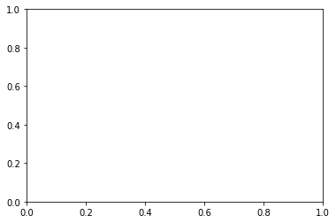

# Collaboration and Competition

Neilkunal Panchal Deep RL nano Degree
---

In this notebook, you will learn how to use the Unity ML-Agents environment for the third project of the [Deep Reinforcement Learning Nanodegree](https://www.udacity.com/course/deep-reinforcement-learning-nanodegree--nd893) program.

### 1. Start the Environment

We begin by importing the necessary packages.  If the code cell below returns an error, please revisit the project instructions to double-check that you have installed [Unity ML-Agents](https://github.com/Unity-Technologies/ml-agents/blob/master/docs/Installation.md) and [NumPy](http://www.numpy.org/).


```python

from unityagents import UnityEnvironment
import numpy as np
import torch
```

Next, we will start the environment!  **_Before running the code cell below_**, change the `file_name` parameter to match the location of the Unity environment that you downloaded.

- **Mac**: `"path/to/Tennis.app"`
- **Windows** (x86): `"path/to/Tennis_Windows_x86/Tennis.exe"`
- **Windows** (x86_64): `"path/to/Tennis_Windows_x86_64/Tennis.exe"`
- **Linux** (x86): `"path/to/Tennis_Linux/Tennis.x86"`
- **Linux** (x86_64): `"path/to/Tennis_Linux/Tennis.x86_64"`
- **Linux** (x86, headless): `"path/to/Tennis_Linux_NoVis/Tennis.x86"`
- **Linux** (x86_64, headless): `"path/to/Tennis_Linux_NoVis/Tennis.x86_64"`

For instance, if you are using a Mac, then you downloaded `Tennis.app`.  If this file is in the same folder as the notebook, then the line below should appear as follows:
```
env = UnityEnvironment(file_name="Tennis.app")
```


```python
env = UnityEnvironment(file_name="/home/neilkunal/Desktop/DeepRL/deep-reinforcement-learning/p3_collab-compet/Tennis_Linux/Tennis.x86_64")
```

    INFO:unityagents:
    'Academy' started successfully!
    Unity Academy name: Academy
            Number of Brains: 1
            Number of External Brains : 1
            Lesson number : 0
            Reset Parameters :
    		
    Unity brain name: TennisBrain
            Number of Visual Observations (per agent): 0
            Vector Observation space type: continuous
            Vector Observation space size (per agent): 8
            Number of stacked Vector Observation: 3
            Vector Action space type: continuous
            Vector Action space size (per agent): 2
            Vector Action descriptions: , 


Environments contain **_brains_** which are responsible for deciding the actions of their associated agents. Here we check for the first brain available, and set it as the default brain we will be controlling from Python.


```python
# get the default brain
brain_name = env.brain_names[0]
brain = env.brains[brain_name]
```

### 2. Examine the State and Action Spaces

In this environment, two agents control rackets to bounce a ball over a net. If an agent hits the ball over the net, it receives a reward of +0.1.  If an agent lets a ball hit the ground or hits the ball out of bounds, it receives a reward of -0.01.  Thus, the goal of each agent is to keep the ball in play.

The observation space consists of 8 variables corresponding to the position and velocity of the ball and racket. Two continuous actions are available, corresponding to movement toward (or away from) the net, and jumping. 

Run the code cell below to print some information about the environment.


```python
# reset the environment
env_info = env.reset(train_mode=True)[brain_name]

# number of agents 
num_agents = len(env_info.agents)
print('Number of agents:', num_agents)

# size of each action
action_size = brain.vector_action_space_size
print('Size of each action:', action_size)

# examine the state space 
states = env_info.vector_observations
state_size = states.shape[1]
print('There are {} agents. Each observes a state with length: {}'.format(states.shape[0], state_size))
print('The state for the first agent looks like:', states[0])
```

    Number of agents: 2
    Size of each action: 2
    There are 2 agents. Each observes a state with length: 24
    The state for the first agent looks like: [ 0.          0.          0.          0.          0.          0.
      0.          0.          0.          0.          0.          0.
      0.          0.          0.          0.         -6.65278625 -1.5
     -0.          0.          6.83172083  6.         -0.          0.        ]


### 3. Take Random Actions in the Environment

In the next code cell, you will learn how to use the Python API to control the agents and receive feedback from the environment.

Once this cell is executed, you will watch the agents' performance, if they select actions at random with each time step.  A window should pop up that allows you to observe the agents.

Of course, as part of the project, you'll have to change the code so that the agents are able to use their experiences to gradually choose better actions when interacting with the environment!


```python
# for i in range(1, 6):                                      # play game for 5 episodes
#     env_info = env.reset(train_mode=False)[brain_name]     # reset the environment    
#     states = env_info.vector_observations                  # get the current state (for each agent)
#     scores = np.zeros(num_agents)                          # initialize the score (for each agent)
#     while True:
#         actions = np.random.randn(num_agents, action_size) # select an action (for each agent)
#         actions = np.clip(actions, -1, 1)                  # all actions between -1 and 1
#         env_info = env.step(actions)[brain_name]           # send all actions to tne environment
#         next_states = env_info.vector_observations         # get next state (for each agent)
#         rewards = env_info.rewards                         # get reward (for each agent)
#         dones = env_info.local_done                        # see if episode finished
#         scores += env_info.rewards                         # update the score (for each agent)
#         states = next_states                               # roll over states to next time step
#         if np.any(dones):                                  # exit loop if episode finished
#             break
#     print('Score (max over agents) from episode {}: {}'.format(i, np.max(scores)))
```

When finished, you can close the environment.


```python
# env.close()
```


```python
from ddpg_agent import Agents
import matplotlib.pyplot as plt
from collections import deque
# num_agents=1
# agent = Agents(state_size=state_size, action_size=action_size, num_agents=num_agents, random_seed=0)
# agent.action_size
agent0 = Agents(state_size=state_size, action_size=action_size, num_agents=1, random_seed=0)
agent1 = Agents(state_size=state_size, action_size=action_size, num_agents=1, random_seed=0)

# agent0_weights = 'cp_actor0.pth'
# agent1_weights = 'cp_actor1.pth'
# agent0.actor_local.load_state_dict(torch.load(agent0_weights))
# agent1.actor_local.load_state_dict(torch.load(agent1_weights))

# agent0_weights = 'checkpoint_actor_0.pth'
# agent1_weights = 'checkpoint_actor_1.pth'
# agent0.actor_local.load_state_dict(torch.load(agent0_weights))
# agent1.actor_local.load_state_dict(torch.load(agent1_weights))

# critic0_weights = 'checkpoint_critic_0.pth'
# critic1_weights = 'checkpoint_critic_1.pth'
# agent0.critic_local.load_state_dict(torch.load(critic0_weights))
# agent1.critic_local.load_state_dict(torch.load(critic1_weights))
```

### 4. It's Your Turn!

Now it's your turn to train your own agent to solve the environment!  When training the environment, set `train_mode=True`, so that the line for resetting the environment looks like the following:
```python
env_info = env.reset(train_mode=True)[brain_name]
```


```python
# def ddpg(n_episodes=1000, max_t=10000, print_every=100):
#     """DDQN Algorithm.
    
#     Params
#     ======
#         n_episodes (int): maximum number of training episodes
#         max_t (int): maximum number of timesteps per episode
#         print_every (int): frequency of printing information throughout iteration """
    
#     scores = []
#     scores_deque = deque(maxlen=print_every)
    
#     for i_episode in range(1, n_episodes+1):
#         env_info = env.reset(train_mode=True)[brain_name]
#         agent.reset()
#         state = env_info.vector_observations[0]            # get the current state
#         score = 0
#         Toggle = True
#         combined_action = np.zeros(num_agents*action_size)
#         print("combined action is:", combined_action)
#         print("combined action[0:1] is:", combined_action[0:1])
#         for t in range(max_t):
#             action = agent.act(state)  
#             # select an action
# #             print(agent)
# #             print(state)
# #             print(action)
#             if Toggle:
#                 combined_action[2:4] = action 
#             else:
#                 combined_action[0:2] = action 
#             env_info = env.step(combined_action)[brain_name]        # send the action to the environment
#             next_state = env_info.vector_observations[0]   # get the next state
#             reward = env_info.rewards[0]                   # get the reward
#             done = env_info.local_done[0]                  # see if episode has finished
#             agent.step(state, action, reward, next_state, done) # take step with agent (including learning)
#             score += reward                                # update the score
#             state = next_state                             # roll over the state to next time step
#             if done:                                       # exit loop if episode finished
#                 break
        
#         scores_deque.append(score)       # save most recent score
#         scores.append(score)             # save most recent score

#         print('\rEpisode {}\tAverage Score: {:.2f}'.format(i_episode, np.mean(scores_deque)), end="")
        
#         if i_episode % print_every == 0:
#             print('\rEpisode {}\tAverage Score: {:.2f}'.format(i_episode, np.mean(scores_deque)))
#             torch.save(agent.actor_local.state_dict(), 'checkpoint_actor.pth')
#             torch.save(agent.critic_local.state_dict(), 'checkpoint_critic.pth')
        
#         if np.mean(scores_deque)>=30.0:
#             print('\nEnvironment solved in {:d} episodes!\tAverage Score: {:.2f}'.format(i_episode, np.mean(scores_deque)))
#             torch.save(agent.actor_local.state_dict(), 'checkpoint_actor.pth')
#             torch.save(agent.critic_local.state_dict(), 'checkpoint_critic.pth')
#             break
            
#     return scores
```


```python

```

The Training is solved when the average over 100 episodes is greater than 0.5


```python

solved = 0.5
consecutiveEpisodes = 100
printFrequency = 40
addNoise = True

def Maddpg(n_episodes=700, max_t=1000, train_mode=True):
    """Multi-Agent Deep Deterministic Policy Gradient (MADDPG)
    
    Params
    ======
        n_episodes (int)      : maximum number of training episodes
        max_t (int)           : maximum number of timesteps per episode
        train_mode (bool)     : if 'True' set environment to training mode

    """
    def returnActions(states, add_noise):
        '''return actions'''
        action0 = agent0.act(states, add_noise)    
        action1 = agent1.act(states, add_noise)   
        out = np.concatenate((action0, action1), axis=0).flatten()
        return out
    
    scores_window = deque(maxlen=consecutiveEpisodes)
    scores_all = []
    moving_average = []
    best_score = -np.inf
    best_episode = 0
    already_solved = False    

    for i_episode in range(1, n_episodes+1):
        env_info = env.reset(train_mode=train_mode)[brain_name]  
        states = np.reshape(env_info.vector_observations, (1,48)) # combine states
        agent0.reset()
        
        agent1.reset()
        scores = np.zeros(num_agents)
        while True:
            actions = returnActions(states, addNoise)           
            env_info = env.step(actions)[brain_name]          
            next_states = np.reshape(env_info.vector_observations, (1, 48)) # combine the agent next states
            rewards = env_info.rewards                         # get reward
            done = env_info.local_done                         # see if episode finished
            agent0.step(states, actions, rewards[0], next_states, done, 0) # agent 1 learning
            agent1.step(states, actions, rewards[1], next_states, done, 1) # agent 2 learning
            scores += np.max(rewards)                          # update the score for each agent
            states = next_states                              
            if np.any(done):                                   # exit loop if episode finished
                break

        ep_best_score = np.max(scores)
        scores_window.append(ep_best_score)
        scores_all.append(ep_best_score)
        moving_average.append(np.mean(scores_window))

        # save best score                        
        if ep_best_score > best_score:
            best_score = ep_best_score
            best_episode = i_episode
        
        # print results
        if i_episode % printFrequency == 0:
            print('Training Episodes {:0>4d} to {:0>4d}\tRewardMax: {:.3f}\t RunningMean: {:.3f}'.format(
                i_episode-printFrequency, i_episode, np.max(scores_all[-printFrequency:]), moving_average[-1]))

        # determine if environment is solved and keep best performing models
        if moving_average[-1] - solved >= 0:
            if not already_solved:
                print(' Environment reached reward > 0.5 in {:d} episodes \
                \n Running Mean: {:.3f} in last {:d} episodes'.format(
                    i_episode-consecutiveEpisodes, moving_average[-1], consecutiveEpisodes))
                already_solved = True
         
                torch.save(agent0.actor_local.state_dict(), 'cpactor0.pth')
                torch.save(agent0.critic_local.state_dict(), 'cparitic0.pth')
                torch.save(agent1.actor_local.state_dict(), 'cpactor1.pth')
                torch.save(agent1.critic_local.state_dict(), 'cpcritic1.pth')
            elif ep_best_score >= best_score:
                print('Better episode\
                \nEpisode {:0>4d}\RewardMax: {:.3f}\tMoving Average: {:.3f}'.format(
                i_episode, ep_best_score, moving_average[-1]))

                torch.save(agent0.actor_local.state_dict(), 'cpactor0.pth')
                torch.save(agent0.critic_local.state_dict(), 'cpcritic0.pth')
                torch.save(agent1.actor_local.state_dict(), 'cpactor1.pth')
                torch.save(agent1.critic_local.state_dict(), 'cpcritic1.pth')
            else:
                continue
            
    return scores_all, moving_average
```


```python
scores, averages = Maddpg()


```

    Training Episodes 0000 to 0030	RewardMax: 0.100	 RunningMean: 0.017
    Training Episodes 0030 to 0060	RewardMax: 0.100	 RunningMean: 0.017
    Training Episodes 0060 to 0090	RewardMax: 0.100	 RunningMean: 0.018
    Training Episodes 0090 to 0120	RewardMax: 0.100	 RunningMean: 0.025
    Training Episodes 0120 to 0150	RewardMax: 0.200	 RunningMean: 0.030
    Training Episodes 0150 to 0180	RewardMax: 0.200	 RunningMean: 0.032
    Training Episodes 0180 to 0210	RewardMax: 0.200	 RunningMean: 0.040
    Training Episodes 0210 to 0240	RewardMax: 0.200	 RunningMean: 0.048
    Training Episodes 0240 to 0270	RewardMax: 0.200	 RunningMean: 0.043
    Training Episodes 0270 to 0300	RewardMax: 0.100	 RunningMean: 0.032
    Training Episodes 0300 to 0330	RewardMax: 0.200	 RunningMean: 0.021
    Training Episodes 0330 to 0360	RewardMax: 0.100	 RunningMean: 0.017
    Training Episodes 0360 to 0390	RewardMax: 0.300	 RunningMean: 0.033
    Training Episodes 0390 to 0420	RewardMax: 0.400	 RunningMean: 0.049
    Training Episodes 0420 to 0450	RewardMax: 0.300	 RunningMean: 0.079
    Training Episodes 0450 to 0480	RewardMax: 0.600	 RunningMean: 0.100
    Training Episodes 0480 to 0510	RewardMax: 0.300	 RunningMean: 0.103
    Training Episodes 0510 to 0540	RewardMax: 0.900	 RunningMean: 0.113
    Training Episodes 0540 to 0570	RewardMax: 0.900	 RunningMean: 0.114
    Training Episodes 0570 to 0600	RewardMax: 1.100	 RunningMean: 0.159
     Environment reached reward > 0.5 in 520 episodes                 
     Running Mean: 0.507 in last 100 episodes
    Training Episodes 0600 to 0630	RewardMax: 5.300	 RunningMean: 0.582
    Better episode                
    Episode 0652\RewardMax: 5.300	Moving Average: 0.950
    Training Episodes 0630 to 0660	RewardMax: 5.300	 RunningMean: 0.945
    Better episode                
    Episode 0663\RewardMax: 5.300	Moving Average: 1.077
    Training Episodes 0660 to 0690	RewardMax: 5.300	 RunningMean: 1.157
    Training Episodes 0690 to 0720	RewardMax: 0.600	 RunningMean: 0.831
    Training Episodes 0720 to 0750	RewardMax: 1.100	 RunningMean: 0.541
    Training Episodes 0750 to 0780	RewardMax: 1.800	 RunningMean: 0.285
    Training Episodes 0780 to 0810	RewardMax: 5.200	 RunningMean: 0.437
    Better episode                
    Episode 0822\RewardMax: 5.300	Moving Average: 0.641
    Better episode                
    Episode 0835\RewardMax: 5.300	Moving Average: 0.941
    Training Episodes 0810 to 0840	RewardMax: 5.300	 RunningMean: 0.952
    Training Episodes 0840 to 0870	RewardMax: 5.200	 RunningMean: 1.245
    Training Episodes 0870 to 0900	RewardMax: 5.200	 RunningMean: 1.496
    Better episode                
    Episode 0905\RewardMax: 5.300	Moving Average: 1.641
    Training Episodes 0900 to 0930	RewardMax: 5.300	 RunningMean: 1.262
    Training Episodes 0930 to 0960	RewardMax: 5.200	 RunningMean: 1.247
    Training Episodes 0960 to 0990	RewardMax: 5.200	 RunningMean: 1.052
    Better episode                
    Episode 1014\RewardMax: 5.300	Moving Average: 1.075
    Training Episodes 0990 to 1020	RewardMax: 5.300	 RunningMean: 1.121
    Better episode                
    Episode 1031\RewardMax: 5.300	Moving Average: 1.256
    Training Episodes 1020 to 1050	RewardMax: 5.300	 RunningMean: 1.130
    Training Episodes 1050 to 1080	RewardMax: 2.500	 RunningMean: 0.948
    Training Episodes 1080 to 1110	RewardMax: 0.700	 RunningMean: 0.762
    Training Episodes 1110 to 1140	RewardMax: 0.500	 RunningMean: 0.268
    Training Episodes 1140 to 1170	RewardMax: 5.200	 RunningMean: 0.403
    Training Episodes 1170 to 1200	RewardMax: 5.200	 RunningMean: 0.531
    Training Episodes 1200 to 1230	RewardMax: 5.200	 RunningMean: 0.776
    Training Episodes 1230 to 1260	RewardMax: 2.700	 RunningMean: 0.775
    Better episode                
    Episode 1267\RewardMax: 5.300	Moving Average: 0.706


```python
import matplotlib.pyplot as plt
import numpy as np
fig = plt.figure()
ax = fig.add_subplot(111)
plt.plot(np.arange(1, len(scores)+1), scores)
plt.ylabel('Score')
plt.xlabel('Episode #')
plt.show()
```


    ---------------------------------------------------------------------------

    NameError                                 Traceback (most recent call last)

    <ipython-input-4-0064cfabe7dc> in <module>
          3 fig = plt.figure()
          4 ax = fig.add_subplot(111)
    ----> 5 plt.plot(np.arange(1, len(scores)+1), scores)
          6 plt.ylabel('Score')
          7 plt.xlabel('Episode #')


    NameError: name 'scores' is not defined





```python
consecutiveEpisodes = 10
printFrequency = 1
addNoise = False
```


```python
## reinitialize the agents (if needed)
agent0 = Agents(state_size, action_size, num_agents=1, random_seed=0)
agent1 = Agents(state_size, action_size, num_agents=1, random_seed=0)

# load the weights from file
agent0_weights = 'cp_actor0.pth'
agent1_weights = 'cp_actor1.pth'
agent0.actor_local.load_state_dict(torch.load(agent0_weights))
agent1.actor_local.load_state_dict(torch.load(agent1_weights))
```


```python
def test(n_episodes=10, max_t=1000, train_mode=False):
    def returnActions(states, add_noise):
        '''return actions'''
        action0 = agent0.act(states, add_noise)    
        action1 = agent1.act(states, add_noise)   
        out = np.concatenate((action0, action1), axis=0).flatten()
        return out

    scores_window = deque(maxlen=consecutiveEpisodes)
    scores_all = []
    moving_average = []  

    for i_episode in range(1, n_episodes+1):
        env_info = env.reset(train_mode=train_mode)[brain_name]         # reset the environment
        states = np.reshape(env_info.vector_observations, (1,48)) # get states and combine them
        scores = np.zeros(num_agents)
        while True:
            actions = returnActions(states, addNoise)           # choose agent actions and combine them
            env_info = env.step(actions)[brain_name]           # send both agents' actions together to the environment
            next_states = np.reshape(env_info.vector_observations, (1, 48)) # combine the agent next states
            rewards = env_info.rewards                         # get reward
            done = env_info.local_done                         # see if episode finished
            scores += np.max(rewards)                          # update the score for each agent
            states = next_states                               # roll over states to next time step
            if np.any(done):                                   # exit loop if episode finished
                break

        ep_best_score = np.max(scores)
        scores_window.append(ep_best_score)
        scores_all.append(ep_best_score)
        moving_average.append(np.mean(scores_window))

        # print results
        if i_episode % printFrequency == 0:
            print('TestingEpisodes {:0>4d}to{:0>4d}\tRewardMax: {:.3f}\tRunningMean: {:.3f}'.format(
                i_episode-printFrequency, i_episode, np.max(scores_all[-printFrequency:]), moving_average[-1]))
            
    return scores_all, moving_average
test()

```
